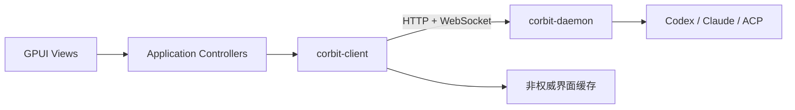

# Corbit App

Corbit App 是使用 Rust、GPUI 和 GPUI Component 构建的原生桌面客户端。它连接
独立运行的 Corbit Daemon，用于管理项目、工作区和 AI 编程 Agent。

> 项目状态：Codex、Claude 与 ACP Agent 控制闭环及只读工作区检查已完成。桌面端可提交
> Prompt、处理权限、中断活动 Turn、恢复权威时间线，并通过 Daemon 浏览目录和预览
> UTF-8 文本、检查 Git 状态和预览统一差异；全局搜索、任务筛选和活动中心直接使用
> Daemon 权威快照与当前连接事件，工作区视图会根据变化通知自动刷新。
> Daemon Endpoint 已可在设置中持久化，macOS Token 只写入系统钥匙串；Windows 与
> Linux 的系统凭证适配仍属于后续阶段。

## 已确定的技术方向

- 语言：Rust。
- UI：GPUI + GPUI Component。
- 后台：独立的 Node.js + TypeScript `corbit-daemon`。
- 通信：HTTP 健康检查 + WebSocket RPC、事件和流式数据。
- 首要平台：macOS；Windows 和 Linux 在各自 CI 与真机验证通过后再标记支持。
- 生命周期：关闭桌面窗口不应终止 Daemon 或正在运行的 Agent。
- macOS 生命周期：关闭最后一个窗口只关闭界面，菜单栏状态图标继续运行；可从状态图标
  重新显示窗口或显式退出 Corbit。

## 系统位置



Corbit App 负责桌面交互、窗口和本地展示状态。Agent 生命周期、Provider、权限
裁决和权威时间线属于 Daemon。

## 职责边界

桌面端负责：

- 展示 Host、Project、Workspace、Agent 和 Timeline。
- 发送创建 Agent、Prompt、权限裁决和终端输入等命令。
- 实现侧栏、标签、分栏、窗口、快捷键和原生菜单。
- 维护连接状态、重连进度和有限的非权威显示缓存。
- 安全保存 Daemon Endpoint 与客户端凭证。
- 提供 Daemon 安装、状态检测和启动入口（进入对应开发阶段后）。

桌面端不负责：

- 直接调用 Claude、Codex 或 ACP SDK。
- 持有权威 Agent 状态。
- 在 GPUI View 中直接操作 WebSocket。
- 因窗口关闭而停止独立 Daemon。
- 绕过 Daemon 直接执行手机端或 Agent 请求的主机命令。

## Daemon 交互

本机默认连接流程：

1. 对配置的 loopback Endpoint 调用 `GET /health`。
2. 使用本地凭证建立 WebSocket。
3. 发送包含客户端版本、协议版本、capabilities 和恢复游标的 `hello`。
4. 接收 `server_info`，在一个入口完成版本与功能判断。
5. 调用 `state.snapshot` 获取 Project、Workspace 和 Agent 权威快照，已实现。
6. 通过 `workspace.files.list` 浏览相对目录，通过 `workspace.file.read` 预览受限的
   UTF-8 文本；桌面端不直接访问工作区文件系统，已实现。
7. 通过 `workspace.git.status` 检查限定到工作区的未提交变更，通过
   `workspace.git.diff` 预览单路径统一差异；桌面端不直接启动 Git，已实现。
8. 订阅临时 `workspace.changed` 通知，按相对路径使当前目录、文本、Git 状态和 Diff
   缓存失效；该通知不推进持久化事件游标，已实现。
9. 资源操作携带稳定 `clientMutationId`，成功后重新获取权威快照，已实现。
10. 订阅 `agent.timeline`，按 `turnId` 合并当前 Agent 的实时文本增量，已实现。
11. 订阅 `agent.permission` 并通过 `agent.approval.resolve` 提交明确裁决，已实现。
12. 通过 `agent.interrupt` 中断当前活动 Turn，已实现。
13. 断线后携带最后已提交游标重连；Daemon 要求重置时清空本地事件状态并重放权威
    时间线，已实现。

协议由 `corbit-daemon` 工程维护。桌面端不得自行增加仅有 Rust 能理解的线协议字段。

## 当前工程结构

```text
corbit-app/
├── Cargo.toml
├── Cargo.lock
├── rust-toolchain.toml
├── assets/brand/           # Logo 母版、Icon Composer 源工程及平台打包图标
├── scripts/
│   ├── build-utils.mjs              # 桌面打包参数和安全目录操作
│   ├── generate_brand_assets.sh
│   └── package-desktop.mjs          # 生成各平台可发布目录
├── crates/
│   ├── corbit-protocol/   # serde 消息/资源模型和 Daemon fixture 兼容测试
│   ├── corbit-client/     # HTTP、WebSocket、RPC、mutation、快照和 runtime bridge
│   └── corbit-app/
│       └── src/
│           ├── main.rs             # 最小进程入口
│           └── app/
│               ├── mod.rs          # 连接编排、共享界面状态和根视图
│               ├── branding.rs     # 内嵌品牌资产与共享 Logo Element
│               ├── connection.rs   # Endpoint 持久化与系统凭证存储
│               ├── discovery.rs    # 全局搜索与活动中心
│               ├── event_batch.rs  # 高频时间线增量的有界帧批处理
│               ├── resources.rs    # Project / Workspace / Agent 管理
│               ├── settings.rs     # 连接、Provider、快捷键、设备和关于设置
│               ├── tasks.rs        # 新建任务、任务总览和状态筛选
│               ├── theme.rs        # Codex 风格尺寸、字体和颜色令牌
│               ├── timeline.rs     # Prompt、Turn、权限和时间线视图
│               └── workspace.rs    # 文件浏览与 Git 只读检查
└── rustfmt.toml
```

当前依赖方向：

```text
GPUI Views -> Controllers -> corbit-client -> corbit-protocol
```

`corbit-protocol` 只描述线协议；`corbit-client` 负责传输与同步；GPUI 应用按资源、
时间线和工作区检查划分模块，View 只发送用户意图并渲染应用状态。进程入口不承载
业务状态或 RPC 逻辑。

## 品牌与图标

Corbit 标志采用扁平化的“三向连接”概念：三个圆角连接件围绕留白核心，表示桌面端、
移动端和 Agent 通过 Corbit Daemon 协作。图形不包含字母、文字、渐变、阴影或装饰色，
只使用纯黑 `#0A0A0A` 与纯白 `#FFFFFF`，保证 Dock 与界面小尺寸下仍保持一致轮廓。

- `corbit-symbol-light.svg` 和 `corbit-symbol-dark.svg` 由 GPUI `BrandAssets` 编译进程序；
  `brand_mark` 根据当前主题自动选择，不依赖运行目录中的外部文件。
- `corbit-mark.svg` 是白底黑标的通用品牌标志。
- `corbit-app-icon.svg` 与 `corbit-app-icon-dark.svg` 是白底和黑底两套 Dock 图标母版；
  使用 macOS 标准安全边距和透明圆角画布。当前应用包默认使用白底版 `corbit.icns`，
  同时导出黑底版 `corbit-dark.icns`。
- `Corbit.icon` 是 Apple Icon Composer 的扁平分层源工程（background、tri-link、open core）。
- `corbit-brand-preview.svg` / PNG 是应用图标与浅色/深色 Logo 的对比稿。
- `corbit.icns`、`corbit.ico` 和 PNG 是由 SVG 母版生成的打包资产；正式打包流水线
  建立后应直接引用这些文件，不再维护另一份图形。

在 macOS 上重新生成桌面图标：

```bash
bash scripts/generate_brand_assets.sh
```

生成脚本需要 Xcode Command Line Tools 的 `xcrun`，以及 macOS 系统 `sips` 和
`iconutil`。SVG 通过 AppKit 原生透明位图上下文导出，避免 Quick Look 将 Dock 图标的
透明圆角铺成白色方块。设计调整只修改 SVG 母版，再统一重新导出，避免平台图标漂移。

## 异步与 GPUI 边界

- 当前连接页使用一个独立的 Tokio current-thread runtime/线程；GPUI executor
  不直接执行依赖 Tokio reactor 的网络 future。
- WebSocket 由唯一 session driver 读取，克隆的连接 handle 通过请求 ID 并发路由
  RPC 与心跳响应，不允许多个调用方竞争读取 socket。
- Client 的命令通道容量为 64；流式事件通道容量为 512。UI runtime bridge 也使用
  512 的有界队列，出现滞后时明确报告错误而不是无限积压。
- 单请求超时或 future 被取消时只移除本地等待项；迟到响应会被忽略，不会误配给
  其他请求。协议尚未定义远端取消消息，因此这不等同于终止 Daemon 侧执行。
- 可恢复的网络、健康检查和心跳错误使用 500ms 起、15s 封顶的指数退避自动重连；
  认证失败、协议不兼容和协议错误不会形成重连风暴。
- `corbit-client` 在连接间保留 `serverId` 与最后连续 `sequence`，只提交成功解码的事件
  游标；重连握手期间消费 `event_sync`，忽略重复事件，并将序列缺口视为可恢复断线。
- Daemon 返回 `reset: true` 时发出 `HistoryReset`，GPUI 清空时间线和待处理权限后按
  重放事件重建；普通短暂断线保留现有时间线，只应用缺失增量。
- 重连时不自动重放 RPC，避免重复执行有副作用的 mutation；调用方会收到未连接错误。
- Project / Workspace / Agent mutation 由 UI 生成 `clientMutationId`；响应不确定时，再次提交
  相同操作复用该 ID，成功后必须重新拉取快照，不用本地乐观状态代替 Daemon 权威值。
- 每个新 WebSocket 会话在对 UI 开放通用 RPC 前自动获取 `state.snapshot`；重连也会
  重新获取，断线时立即丢弃旧权威快照。
- 目录和文件读取使用独立异步任务；切换工作区、断线或快照使选择失效时立即清空
  文件状态，并校验响应的 `workspaceId` 和相对路径，避免陈旧回包覆盖当前界面。
- `workspace.changed` 根据当前目录的直接子项和当前文件精确匹配刷新；事件风暴期间
  每类读取只保留最新待执行目标，并与正在执行的请求串行，避免并发回包相互覆盖。
  空路径集合表示整个工作区失效。通知不会被重放，因此断线会清空文件/Git 临时状态，
  重连后由新快照恢复资源选择，工作区视图再次打开时重新读取。
- Git 状态和差异使用独立异步任务；同样在工作区变化或断线时清空，并校验响应的
  `workspaceId` 与请求路径。桌面端只展示 Daemon 返回的临时只读结果。
- GPUI 状态只能在正确的应用上下文中更新。
- runtime handle 被释放时会请求 WebSocket 正常关闭，但不会在 UI 线程等待网络线程。
- Assistant、Reasoning 和命令输出增量按 16ms 帧窗口、每批最多 256 条进入一次 GPUI
  状态更新和自动滚动；Turn 生命周期、权限、连接状态与错误保持为批次边界，不跨事件
  重排。每个 Agent 的 Turn 通过索引直接定位，长时间线使用可变高度虚拟列表，仅创建
  可见项和过绘区域；真实性能基准仍需补充。
- 关闭窗口时取消该窗口订阅，但不默认停止远端 Agent。
- 多窗口共享连接还是每窗口连接仍需在后续阶段确定。

当前已经使用 `serde`、`serde_json`、`reqwest`、`tokio`、`tokio-tungstenite`、
`async-channel`、GPUI 0.2.2 和 GPUI Component 0.5.1，解析后的精确依赖版本由
`Cargo.lock` 锁定。GPUI 启用了 `runtime_shaders`，避免构建阶段依赖 Xcode Metal
命令行工具；应用仍要求支持 Metal 的 macOS 图形环境。

## 客户端状态

客户端状态由以下部分组成：

- `ConnectionState`：离线、连接中、认证中、在线、认证失败、协议不兼容，已实现。
- `Reconnecting`：重连次数、下次延迟和断线原因，已实现并由连接页展示。
- `ServerInfo`：Daemon 与协议版本、功能和主机身份，已实现解析与展示。
- `AuthoritativeSnapshot`：Project、Workspace、Agent、schema 版本和 revision，已实现。
- `LiveDelta`：`turn.started`、`assistant.delta`、`turn.completed` 已实现；当前仅保存在
  本次桌面连接的非权威内存中。
- `PendingPermission`：当前连接收到的命令/文件修改请求；断线即清空，不把陈旧请求
  当作仍可裁决的权威状态。
- `WorkspaceFiles`：当前目录列表和单个 UTF-8 文本预览，仅是 Daemon RPC 结果的
  临时显示状态；切换工作区或断线即清空，在线时按相关变化路径自动刷新。
- `WorkspaceGit`：当前 Git 分支、未提交路径和单路径统一差异；非仓库作为普通空状态
  展示，切换工作区或断线即清空，在线时由工作区变化通知自动刷新。
- `EphemeralUiState`：项目/工作区/Agent 选中项、搜索/筛选条件、表单草稿、窗口位置、
  左侧栏与 Files/Changes 分栏宽度已实现；拖拽结束后写入本地界面状态。
- `ReplicaCache`：可选的有限展示缓存，不用于确认操作结果，尚未实现。

恢复缓存后界面必须标明仍在连接；远端同步完成前不能把旧权限请求视为有效。

## 功能范围

| 功能              | 状态                     | 说明                                                    |
| ----------------- | ------------------------ | ------------------------------------------------------- |
| Daemon 检测与连接 | 已完成连接运行时         | health、info、握手、并发 RPC、心跳、重连                |
| GPUI 状态页       | 已完成管理闭环           | 连接/同步状态、资源数量、空状态和操作反馈               |
| 项目与工作区管理  | 已完成基础闭环           | 创建、选择、重命名、归档/恢复、二次确认删除             |
| 新建与任务总览    | 已完成产品入口           | 工作区/Provider 选择、创建、启动并提交首个 Prompt       |
| 全局搜索          | 已完成权威快照搜索       | 实时检索任务、工作区和项目，并跳转到对应功能页          |
| 活动中心          | 已完成连接内聚合         | 汇总待处理权限、Agent 状态和当前连接时间线事件          |
| 任务筛选          | 已完成状态筛选           | 全部、活动中、需处理和已停止                            |
| Agent 资源管理    | 已完成 Provider 会话闭环 | 创建、选择、重命名、启动/停止和二次确认删除             |
| Agent 时间线      | 已完成权威恢复闭环       | 展示 Prompt、文本增量和完成状态，断线后按游标补齐       |
| 时间线增量批处理  | 已完成有界帧批处理       | 16ms/256 条上限，状态边界有序且每批仅触发一次重绘       |
| 长时间线虚拟渲染  | 已完成可变高度虚拟列表   | 仅创建可见 Turn 与过绘区域，并按 Agent/Turn 索引定位    |
| Prompt 编辑与发送 | 已完成实时闭环           | 运行中的可用 Provider Agent 可提交，失败复用 mutation ID |
| 权限批准/拒绝     | 已完成实时闭环           | 仅展示 Daemon 推送的可用决定，由 Daemon 最终裁决        |
| Turn 中断         | 已完成实时闭环           | 仅活动 Turn 可中断，完成状态由时间线事件确认            |
| 设置与设备配对    | 已完成真实 HTTP 闭环      | Codex 风格设置、连接配置、macOS 钥匙串、配对与设备撤销  |
| 导航快捷键        | 已完成                   | 新建、搜索、任务、活动和设置全局切换                    |
| 左侧栏可调宽度    | 已完成                   | 默认对齐 Codex，右边缘可拖拽并跨启动恢复                |
| 工作区可调分栏    | 已完成                   | Files/Changes 列表与预览宽度可拖拽并跨启动恢复          |
| 分栏和多标签      | 规划中                   | 先完成单工作区闭环                                      |
| 工作区文件浏览    | 已完成只读实时闭环       | 目录导航、1 MiB 内 UTF-8 预览和相关路径自动刷新         |
| Git 状态与 Diff   | 已完成只读实时闭环       | 分支、变更、1 MiB 内统一差异和工作区变化自动刷新        |
| 完整终端          | 后续                     | 需要自定义 GPUI 渲染和二进制通道                        |
| 内嵌浏览器        | 后续评估                 | GPUI WebView 能力仍有限                                 |
| 多窗口            | 后续                     | 需先确定连接与窗口状态归属                              |

## 平台状态

| 平台                | 目标     | 当前验证状态                               |
| ------------------- | -------- | ------------------------------------------ |
| macOS Apple Silicon | 首要支持 | workspace 检查和测试已通过；真实窗口待验证 |
| macOS Intel         | 待评估   | 未验证                                     |
| Windows x64         | 计划支持 | 未验证                                     |
| Linux x64           | 计划支持 | 未验证                                     |

GPUI Component 的上游支持矩阵不等于 Corbit App 已在对应平台通过验证。

## 配置与凭证

常规设置页可以编辑并保存 Daemon Endpoint。非敏感地址写入用户配置目录下的
`connection.json`；macOS 上输入的 Token 通过 Security Framework 写入系统钥匙串，
不会进入普通 JSON、界面状态或日志。应用启动后会使用保存的配置自动尝试连接；当地址
指向 `127.0.0.1`、`localhost` 或 `::1` 时，还会自动读取当前用户
`$CORBIT_HOME/credentials.json`（默认 `~/.corbit/credentials.json`）中的 Daemon
凭据。该自动发现只允许回环地址，绝不会把本机根凭据发送到远程主机。

- `CORBIT_DAEMON_URL` 会在本次启动期间覆盖已保存的 Endpoint。
- 凭据优先级为 `CORBIT_AUTH_TOKEN`、系统凭证存储、回环地址的本机 Daemon 凭据。
- 常规设置提供“检测本机 Daemon”，也可以继续手动修改 Endpoint 与 Token；如果 Daemon
  使用了显式 `CORBIT_AUTH_TOKEN`，需为桌面端提供或保存同一个 Token。
- Windows Credential Manager 与 Linux Secret Service 尚未接入；这些平台当前仍需使用
  `CORBIT_AUTH_TOKEN` 保存远程或手动 Token，但回环地址仍支持本机 Daemon 自动发现，
  不会退化为明文保存 Token。
- 设置页可以移除已存的 macOS 钥匙串 Token；移除不会撤销 Daemon 端 Token，也不会
  中断已经认证的连接。

不要把生产凭证写入源码、普通 JSON 配置、崩溃报告或截图。

## Daemon 生命周期

桌面端可以提供以下能力，但不能混淆服务所有权：

- 检测 Daemon 是否安装、运行和兼容。
- 引导安装或升级 Daemon。
- 请求操作系统服务管理器启动 Daemon。
- 打开日志和诊断目录。

正常关闭窗口只关闭 UI。显式“停止 Daemon”必须单独确认，因为这可能中断所有
连接客户端和正在运行的 Agent。

## 开发

需要 Rust 1.97.1、Node.js 24.16.0 和 macOS 图形开发环境。开发时打开两个终端，
分别进入 Daemon 与桌面工程；默认本机开发会自动使用 Daemon 首次启动生成的凭据：

```bash
# 终端 1：corbit-daemon/
make dev

# 终端 2：corbit-app/
make dev
```

`corbit-app` 中的 `make dev` 只启动桌面端，要求 Daemon 已在运行。如果启动 Daemon 时
显式设置了 `CORBIT_AUTH_TOKEN`，桌面端也必须使用同一个 Token，或在 macOS 常规设置中
手动保存；如果 Daemon 不在默认地址，可在设置中保存地址，或临时设置
`CORBIT_DAEMON_URL="http://127.0.0.1:端口"`。

`make dev` 会先完成构建，再停止本工程 PID 文件追踪的旧调试实例并启动新实例；它不会
按进程名批量结束其他工程或正式版进程。在 macOS 上，开发命令还会把调试二进制和当前
`corbit.icns` 打包到 `target/dev-artifacts/desktop/macos-<架构>/Corbit Dev.app`，使用独立的
开发版 Bundle ID，再从应用包内启动，因此 Dock 会显示 Corbit 项目图标且不会与正式版或
旧构建产物混淆。可用 `make dev-stop` 单独停止追踪中的实例，或用
`make dev-restart` 显式重建并重启。在 macOS 上，关闭最后一个窗口只关闭界面，桌面进程和
菜单栏状态图标继续运行；左键状态图标可重新显示窗口，右键菜单可显示、隐藏或显式退出
Corbit。点击 Dock 图标也会重新创建已关闭的主窗口。以上操作都不会停止独立运行的 Daemon
或其中的 Agent。升级到此机制前已经启动的旧实例没有 PID 记录，需要首次手动退出一次。

工程检查命令：

```bash
cargo check --workspace
cargo test --workspace
make dev
cargo fmt --all -- --check
cargo clippy --workspace --all-targets -- -D warnings
bash scripts/generate_brand_assets.sh
```

## 多平台构建

进入 `corbit-app` 工程目录，使用本工程 Makefile 构建并整理可运行产物：

```bash
cd corbit-app
make build                                # 当前主机平台与架构
make build PLATFORM=macos ARCH=arm64
make macos-universal
make build PLATFORM=linux ARCH=x64
make build PLATFORM=windows ARCH=x64
```

产物写入 `../artifacts/desktop/<platform>-<arch>/`。macOS 输出带品牌图标并完成
ad-hoc 签名的 `Corbit.app`；Linux 和 Windows 输出便携可执行目录。Makefile 能映射
不同 Rust target，但目标系统的链接器、SDK 和 GPUI 原生依赖仍需由对应构建机提供。
仓库通过 `rust-toolchain.toml` 固定 Rust 1.97.1，并提交 `Cargo.lock`。如果全局
Cargo 缓存不可写，可为本次任务设置独立的 `CARGO_HOME`，不要修改系统目录权限。

## 测试要求

- `corbit-protocol` 使用 Daemon 提供的相同 JSON/二进制 fixtures。
- `corbit-client` 当前测试 HTTP、认证 Header、握手、心跳、Echo、认证失败、协议
  不兼容、乱序并发 RPC、超时、调用方取消、迟到响应隔离、强类型权威快照、目录
  列表、文本读取和 Git 状态/差异，以及 Prompt、权限与异步时间线事件、游标补齐和
  重连快照；`workspace.changed` 测试还验证临时事件不会推进恢复游标。真实 Daemon E2E
  还验证三类资源 mutation、工作区文件、真实文件变化通知、Git 检查、Agent 状态约束、
  Prompt 流、权限裁决和 Turn 中断。
- GPUI 工作区测试覆盖整体失效、目录直接子项和文件精确匹配；异步刷新会合并事件风暴，
  并对工作区 ID 与目标路径执行陈旧响应保护。
- 连接设置测试覆盖 Endpoint 往返、向前兼容的缺省字段、环境变量优先级、本机凭据读取、
  回环地址判定与远程地址隔离，以及普通配置绝不序列化 Token；自动测试不会写入或删除
  用户的真实钥匙串项目。
- `daemon_e2e` ignored test 可在显式提供测试 Daemon URL/Token 时验证真实服务，
  不会让日常测试隐式启动或修改用户 Daemon。
- View 测试空状态、加载、离线、认证失败和不兼容版本。
- 终端与长时间线仍需要真机性能基准；长时间线虚拟化已经实现，不能只用编译成功证明
  实际帧率和内存表现。
- 发布前分别在目标系统验证真实窗口、IME、快捷键、休眠恢复和系统凭证。

## 路线图

- [x] 确定 Rust + GPUI + GPUI Component。
- [x] 确定独立 Daemon 与 HTTP/WebSocket 边界。
- [x] 初始化 Cargo workspace 并锁定依赖。
- [x] 实现 health、info、hello、server_info、心跳和连接状态页面。
- [x] 使用 Daemon fixtures 和真实 Daemon E2E 验证基础协议链路。
- [x] 实现单连接 session driver、并发 RPC 路由、超时取消和自动重连。
- [x] 实现项目、工作区和 Agent 权威快照与 GPUI 只读摘要。
- [x] 实现 Project / Workspace 幂等 mutation 与 GPUI 基础管理闭环。
- [x] 实现 Agent 创建、重命名、停止、删除与 GPUI 管理闭环。
- [x] 实现 Codex app-server thread 创建、恢复与 GPUI 启动/停止闭环。
- [x] 根据 Daemon feature map 支持 Codex、Claude 和 ACP Provider 会话。
- [x] 跑通 Prompt 提交、Codex 文本增量和 GPUI 实时时间线闭环。
- [x] 实现权限请求/裁决与 Turn 中断。
- [x] 实现断线重连与权威时间线恢复。
- [x] 为高频时间线增量增加 16ms/256 条有界帧批处理。
- [x] 增加长时间线可变高度虚拟渲染与 Agent/Turn 索引。
- [x] 实现安全只读目录浏览与 UTF-8 文本预览。
- [x] 增加只读 Git 状态和统一差异预览。
- [x] 根据工作区实时变化通知自动刷新当前文件与 Git 视图。
- [x] 增加统一 Logo、GPUI 品牌组件及 macOS/Windows 图标资产。
- [x] 增加 Codex 风格新建任务、任务总览、全局审批和独立双栏设置界面。
- [x] 增加移动端一次性配对链接、配对设备列表和凭证撤销界面。
- [x] 增加 Endpoint 持久化、启动自动连接和 macOS 钥匙串 Token 管理。
- [x] 增加 Files/Changes 可调分栏并持久化面板宽度。
- [ ] 增加分栏和多窗口。
- [ ] 评估并实现终端与内嵌浏览器。
- [ ] 建立 macOS、Windows 和 Linux 发布流水线。

## 相关工程

- `corbit-daemon`：协议和权威状态的拥有者。
- `corbit-flutter`：iOS/Android 客户端。
- GPUI Component：桌面组件库，采用 Apache-2.0 许可证。

仓库 URL 确定后，应把以上项目名替换为稳定链接。

## 许可证

Corbit App 的许可证尚未确定。引入第三方 crate、图标、字体或 Paseo 代码前必须
核对其许可证；依赖 GPUI/GPUI Component 不改变 Paseo 源码自身的 AGPL 义务。
